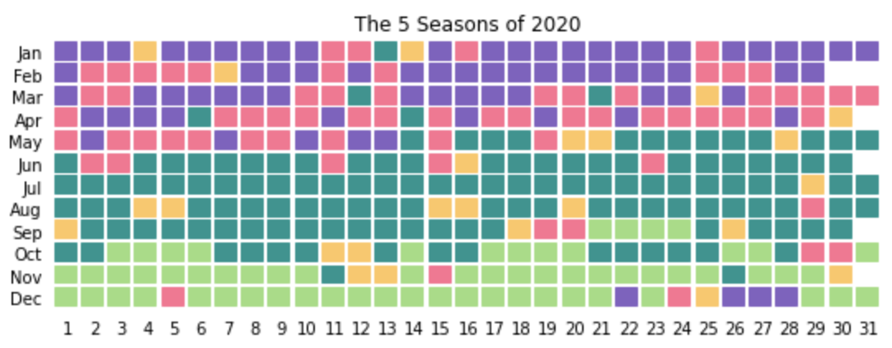
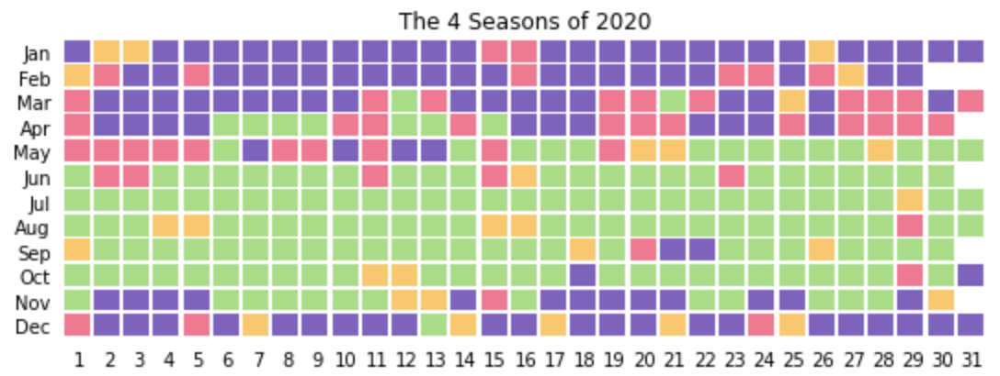
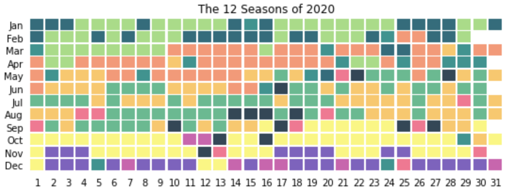
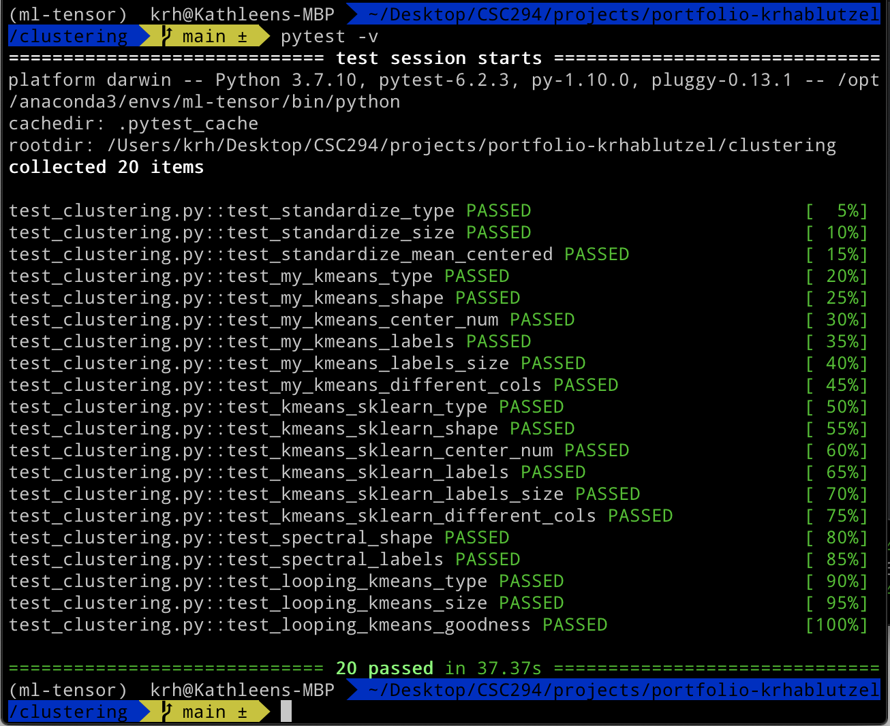

# Building Seasons for North Carolina
### Unsupervised Learning with k-Means Clustering

Here in North Carolina, we often joke that we have [twelve](https://www.reddit.com/r/Charlotte/comments/fuw1bo/the_12_season_of_north_carolina/) [seasons](https://twitter.com/durhamnc/status/1217887940417814529?lang=en) of [weather](https://twitter.com/durhamnc/status/1302644512951619584?lang=en), usually listed as:

- Winter
- Fool’s Spring
- Second Winter
- Spring of Deception
- Third Winter
- The Pollening
- Actual Spring
- Summer
- Hell’s Front Porch
- False Fall
- Second Summer
- Actual Fall

These descriptions subjectively seem to fit our weather more accurately than the traditional Spring, Summer, Autumn, and Winter, but twelve is an oddly specific number. After learning about clustering algorithms, I started wondering, *what is the optimal number of clusters to describe North Carolina's weather?*

In this project, I implement my own k-means algorithm from scratch and compare it to the `sklearn` implementations of k-means and spectral clustering. Then, I test my k-means algorithm with many different values of k to determine the best number of weather clusters for the weather in Raleigh, NC since 2020. I find that North Carolina's weather fits best into five seasons, four of which aproximately correspond with the traditional spring/summer/fall/winter seasons, while a fifth abnormal season pops up throughout the year. I also build calendars of North Carolina weather for 4, 5, and 12 seasons, which demonstrate how North Carolina likes to flop back and forth between seasons, especially in the transitions to spring and fall.

See `clustering.ipynb` for a complete walkthrough of this project. This notebook is a complement to the [classifier project](../classifier), where I see how accurate I can get at predicting the season of a day of weather.

### The Best Fit for NC's Seasons

### Other Seasonal Calendars

#### References Consulted
- [Plotting Calendars](https://dzone.com/articles/plotting-a-calendar-in-matplotlib)
- [Color Palette Generator](https://mycolor.space/)
- [r/Charlotte on NC's 12 seasons](https://www.reddit.com/r/Charlotte/comments/fuw1bo/the_12_season_of_north_carolina/)
- [@DurhamNC on Twitter on NC's 12 seasons, January 2020](https://twitter.com/durhamnc/status/1217887940417814529?lang=en)
- [@DurhamNC on Twitter on NC's 12 seasons, September 2020](https://twitter.com/durhamnc/status/1302644512951619584?lang=en)

#### Proof of Local Tests Passing
