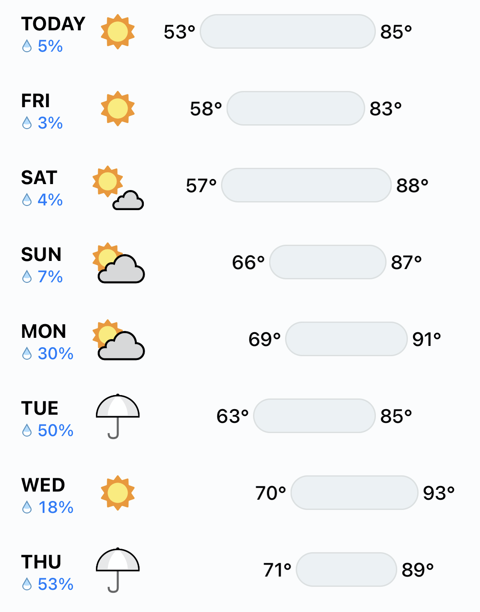
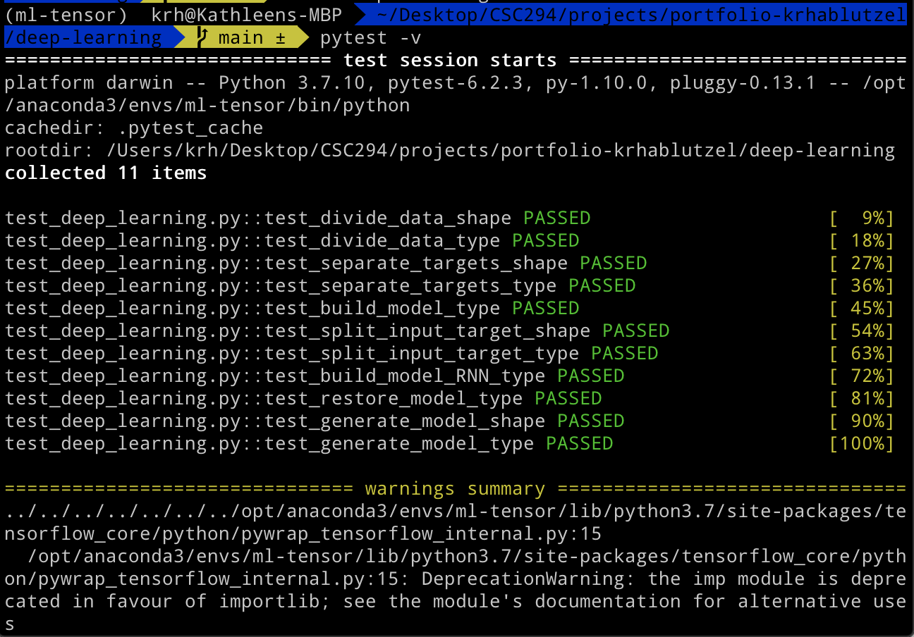

# Will it Rain Tomorrow?
### Deep Learning with Neural Networks and RNNs

For the third component of this portfolio, I wanted to explore a less abstract question about North Carolina's weather than the previous two projects. Unless someone is a time traveler, emerging from a coma, or visiting from the Southern Hemisphere, they probably have a reasonable sense of approximately what season it is. In this project, I address a much more practical and common weather question: *Will it rain tommorrow?*

To answer that question, I build two deep learning models: a standard neural network to predict whether it will rain tomorrow from all the availble information on the current day's weather (14 features), and a recurrent neural network (RNN) that examines whether it has rained each day over the past week in order to predict whether it will rain each day of the following week.

In practice, meteorology is surely much more complicated than throwing some weather data at a neural network and seeing what pops out. However, for this portfolio project, both models achieved encouraging results. The first model may have only been 64% accurate, but 64% is better than random chance. And the results our RNN generated are fairly similar to my weather app's current forecast, an encouraging sign that it started to learn North Carolina's weather trends.

See `deep-learning.ipynb` for a complete walkthrough of this project.

### Example Forecast from Dark Sky

#### References Consulted
- [`tensorflow2` tutorial](https://www.tensorflow.org/tutorials/quickstart/beginner)
- [`tensorflow text generation with an RNN](https://www.tensorflow.org/tutorials/text/text_generation)
- [MacOS `tensorflow` bug](https://www.programmersought.com/article/69923598438/)
- [`tensorflow` loading `numpy` array documentation](https://www.tensorflow.org/tutorials/load_data/numpy)
- [`tensorflow` loading `pandas` array documentation](https://www.tensorflow.org/tutorials/load_data/pandas_dataframe)
- [StackOverflow convert boolean to int array](https://stackoverflow.com/questions/17506163/how-to-convert-a-boolean-array-to-an-int-array)
- [np.random.choice documentation](https://numpy.org/doc/stable/reference/random/generated/numpy.random.choice.html)
- [StackOverflow elements not in index](https://stackoverflow.com/questions/27824075/accessing-numpy-array-elements-not-in-a-given-index-list)
- [StackOverflow shuffle dataframe rows](https://stackoverflow.com/questions/29576430/shuffle-dataframe-rows)
- [tensorflow `Sequential` documentation](https://www.tensorflow.org/api_docs/python/tf/keras/Sequential)

#### Proof of Local Tests Passing

